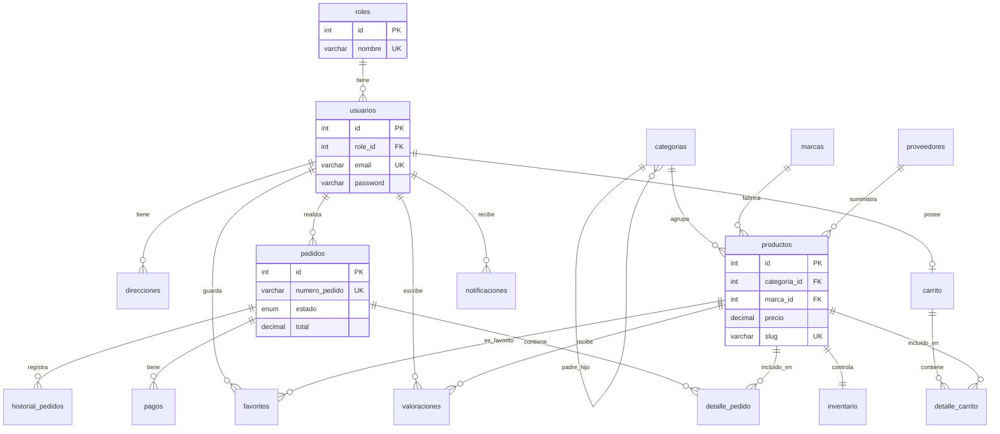

# MARKETPLUS - Diagrama Entidad-Relación

Base de datos: **marketplus_db** | Motor: **MySQL 8.0** | Tablas: **18**

## Diagrama Mermaid

## Relaciones

| Tipo | Relación | Descripción |
|------|----------|-------------|
| 1:N | roles → usuarios | Un rol tiene muchos usuarios |
| 1:N | categorias → productos | Una categoría agrupa muchos productos |
| 1:N | marcas → productos | Una marca tiene muchos productos |
| 1:N | proveedores → productos | Un proveedor suministra muchos productos |
| 1:1 | productos → inventario | Cada producto tiene un registro de stock |
| 1:N | usuarios → pedidos | Un usuario realiza muchos pedidos |
| 1:N | pedidos → detalle_pedido | Un pedido tiene muchos ítems |
| 1:N | pedidos → pagos | Un pedido puede tener pagos asociados |
| 1:N | pedidos → historial_pedidos | Trazabilidad de cambios de estado |
| N:M | usuarios ↔ productos | Via tabla **favoritos** |
| N:M | usuarios ↔ productos | Via tabla **valoraciones** |
| 1:N | carrito → detalle_carrito | Items del carrito activo |

## Tablas del sistema

1. roles
2. usuarios
3. categorias
4. marcas
5. proveedores
6. productos
7. inventario
8. direcciones
9. carrito
10. detalle_carrito
11. pedidos
12. detalle_pedido
13. pagos
14. cupones
15. valoraciones
16. favoritos
17. historial_pedidos
18. notificaciones
